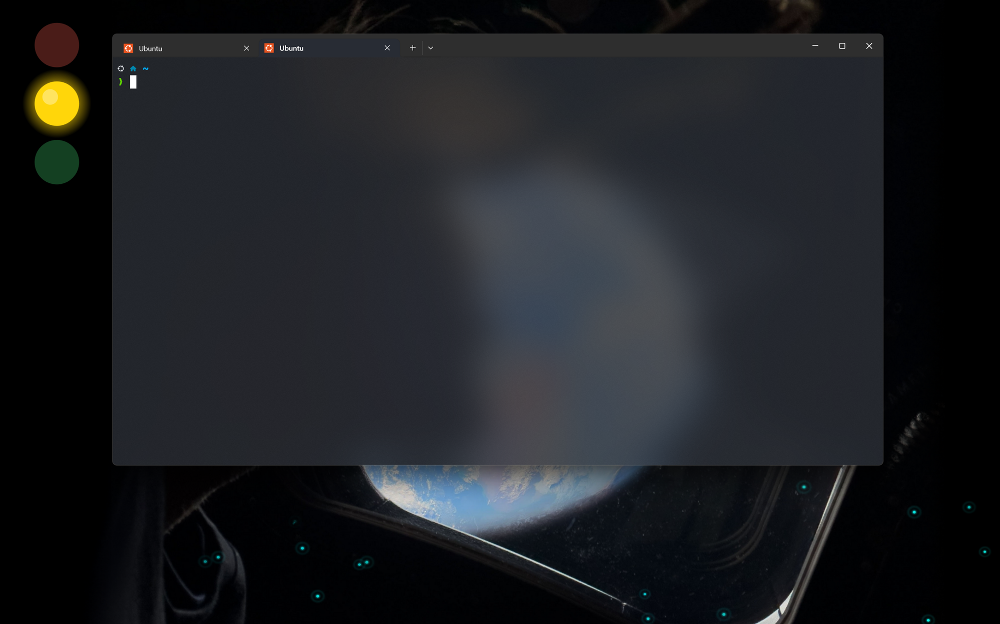

# Claude Code StatusLight · 状态红绿灯

> 中文 | [English](#english)

一个桌面状态指示灯，实时显示 Claude Code 的运行状态——始终可见，始终置顶。

```
🔴 ── 红灯闪烁      = 需要你的授权/选择
🟡 ── 黄灯常亮      = AI 正在思考/运行
🟢 ── 绿灯闪6次常亮 = 任务完成
```



三个彩色圆点悬浮在屏幕**左上角**，位于**所有窗口之上**——即使全屏浏览器或 IDE 也遮挡不住。打开 Claude Code 自动出现，关闭后自动消失。

## 工作原理

```
Claude Code hooks ──写入──▶  state 文件 (busy|wait|done|idle)
watchdog.py        ──写入──▶  alive 心跳 (时间戳)

PowerShell/WPF     ──读取──▶  两个文件，渲染三灯
(始终置顶)
```

- **Hook 全部异步 + 超时保护** — 永远不会卡死 Claude Code
- **Watchdog 通过 `/proc` 父链检测** — 关闭 Claude Code 后灯自动消失
- **WPF 原生窗口** — 真正的透明背景 + Windows 原生置顶

## 环境要求

- **Windows 10/11** + **WSL2**
- **WSLg** 已启用
- **Claude Code** 已安装在 WSL 中
- Python 3（仅用标准库，无需额外安装）

## 快速开始

### 1. 安装

```bash
git clone https://github.com/1829317945/claude-code-statuslight.git ~/.claude/statuslight
```

### 2. 注册 Claude Code Hooks

在 `~/.claude/settings.json` 中添加：

```json
{
  "hooks": {
    "UserPromptSubmit": [
      { "matcher": "", "hooks": [
        { "type": "command", "command": "~/.claude/statuslight/set-state.sh busy", "async": true, "timeout": 5 }
      ]}
    ],
    "PreToolUse": [
      { "matcher": "", "hooks": [
        { "type": "command", "command": "~/.claude/statuslight/set-state.sh busy", "async": true, "timeout": 5 }
      ]}
    ],
    "Notification": [
      { "matcher": "permission_prompt", "hooks": [
        { "type": "command", "command": "~/.claude/statuslight/set-state.sh wait", "async": true, "timeout": 5 }
      ]}
    ],
    "Stop": [
      { "matcher": "", "hooks": [
        { "type": "command", "command": "~/.claude/statuslight/set-state.sh done", "async": true, "timeout": 5 }
      ]}
    ],
    "SessionStart": [
      { "matcher": "", "hooks": [
        { "type": "command", "command": "~/.claude/statuslight/set-state.sh idle", "async": true, "timeout": 5 },
        { "type": "command", "command": "~/.claude/statuslight/launch.sh", "async": true, "timeout": 10 }
      ]}
    ],
    "SessionEnd": [
      { "matcher": "", "hooks": [
        { "type": "command", "command": "~/.claude/statuslight/launch.sh stop", "async": true, "timeout": 10 }
      ]}
    ]
  }
}
```

### 3. 重启 Claude Code

Hooks 在会话启动时加载。关闭并重新打开 Claude Code，左上角即出现三个圆点。

## 手动控制

```bash
~/.claude/statuslight/launch.sh          # 启动显示
~/.claude/statuslight/launch.sh stop     # 停止一切

# 手动测试各状态：
~/.claude/statuslight/set-state.sh busy   # 黄灯常亮
~/.claude/statuslight/set-state.sh wait   # 红灯闪烁
~/.claude/statuslight/set-state.sh done   # 绿灯闪6次
~/.claude/statuslight/set-state.sh idle   # 三灯全暗
```

## 状态对照

| 状态 | 红灯(上) | 黄灯(中) | 绿灯(下) | 含义 |
|------|---------|---------|---------|------|
| `idle` | 暗 | 暗 | 暗 | 等待输入 |
| `busy` | 暗 | **常亮** | 暗 | AI 思考中 |
| `wait` | **闪烁** | 暗 | 暗 | 需要授权 |
| `done` | 暗 | 暗 | **闪6次→常亮** | 任务完成 |

## 文件说明

| 文件 | 职责 | 运行位置 |
|------|------|----------|
| `set-state.sh` | Hook 入口，原子写入状态 | WSL |
| `watchdog.py` | 存活检测，写心跳，Claude 退出后自停 | WSL |
| `statuslight.ps1` | WPF 显示器，渲染三灯，始终置顶 | Windows |
| `launch.sh` | 生命周期管理，启停 watchdog + 显示器 | WSL |
| `xcblibs/` | WSLg 兼容所需的 XCB 辅助库 | WSL |

## 架构决策

### 为什么用 Windows 原生 (WPF) 而不是 WSLg GTK/Qt？
WSLg 的置顶只在 WSLg 窗口之间有效，浏览器/VS Code 仍会遮挡。WPF 的 `TopMost = $true` 是真正的 Windows 系统级置顶。

### 为什么用 `/proc` 父链检测而不是 `pgrep`？
Claude Code 会常驻 `daemon run` 后台进程。简单的 `pgrep -f claude` 会永久匹配这些进程，导致灯永远不灭。Watchdog 遍历父链排除 daemon 后代，只计算真正的交互式会话。

### 为什么 Hook 必须异步？
同步 hook 会阻塞 Claude Code。所有状态灯 hook 使用 `"async": true` 并设置 5-10 秒超时，绝不拖慢 Claude。

## License

MIT — 详见 [LICENSE](LICENSE)。

---

<span id="english"></span>

# Claude Code StatusLight

> [中文](#) | English

A desktop traffic-light indicator showing Claude Code's real-time status — always visible, always on top.

```
🔴 ── Red blinking   = Needs your permission
🟡 ── Yellow solid   = AI thinking / running
🟢 ── Green flash x6 = Task complete
```

Three colored dots float at the screen top-left, **above all windows**. Auto-appears when Claude Code opens, auto-disappears when it closes.

## How It Works

```
Claude Code hooks ──write──▶  state file (busy|wait|done|idle)
watchdog.py        ──write──▶  alive heartbeat

PowerShell/WPF     ──reads──▶  both files, renders 3 dots
(always-on-top)
```

## Requirements

- Windows 10/11 + WSL2 + WSLg
- Claude Code in WSL
- Python 3 (stdlib only)

## Quick Start

```bash
git clone https://github.com/1829317945/claude-code-statuslight.git ~/.claude/statuslight
```

Then add hooks to `~/.claude/settings.json` (see Chinese section above for the full JSON) and restart Claude Code.

## State Reference

| State | Red (top) | Yellow (middle) | Green (bottom) |
|-------|-----------|-----------------|----------------|
| `idle` | dim | dim | dim |
| `busy` | dim | **bright** | dim |
| `wait` | **blinking** | dim | dim |
| `done` | dim | dim | **flash x6→solid** |

## Architecture Decisions

### Why WPF instead of WSLg GTK/Qt?
WSLg's always-on-top only works among WSLg windows. WPF `TopMost = $true` is true system-level, covering browsers and IDEs.

### Why `/proc` ancestry detection?
Claude Code runs a persistent `daemon run` background process. Simple `pgrep` would match it forever. The watchdog walks the parent chain to count only real interactive sessions.

### Why async hooks?
Synchronous hooks block Claude Code. All status-light hooks use `"async": true` with 5–10s timeouts.

## License

MIT — see [LICENSE](LICENSE).
